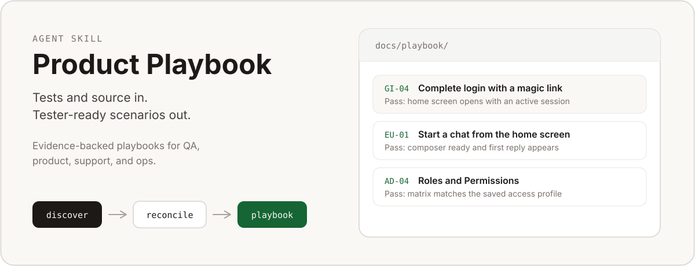
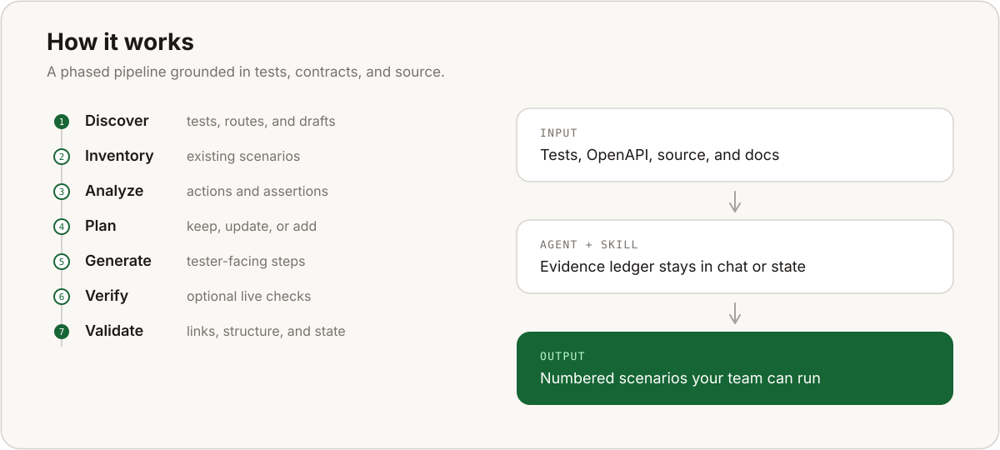

<p align="center">
  
</p>

<p align="center">
  <strong>Turn tests, contracts, source, and documentation into manual playbooks your team can run.</strong><br>
  A portable Agent Skill for QA, product, support, and operations.
</p>

## Install

Install this repository with an Agent Skills compatible installer, then ask:

```bash
npx skills add <github-owner>/<repository>
```

```text
Use $product-playbook with source=product=/path/to/repository and verify=false.
```

Sources may be local directories or Git repository URLs. The bundled helpers require Python 3.9 or
newer and use only the standard library.

<p align="center">
  
</p>

## What it does

Product Playbook discovers product journeys from executable evidence and writes tester-facing
scenarios with direct steps and observable pass criteria.

It supports:

- frontend, API, full-stack, CLI, service, worker, integration, and mobile products;
- local directories and remote Git repositories;
- monorepos and products split across several repositories;
- playbooks stored inside a source repository or in a separate directory;
- complete reconciliation when every component is accessible;
- scoped contributions when a team can access only part of the product;
- portable evidence state without machine-specific paths.

## One-command bootstrap

```bash
python3 scripts/bootstrap_playbook.py \
  --source "web=/path/to/web" \
  --source "api=https://github.com/example/api" \
  --docs-source "docs=/path/to/docs" \
  --output-dir "/path/to/canonical-playbook"
```

Bootstrap acquires remote repositories into a controlled workspace, discovers every accessible
surface, finds tests and commands, identifies existing drafts, and reports the next action.

Use `--source-ref "api=release-tag"` to select a branch, tag, or commit.

After evidence analysis, render a new playbook deterministically:

```bash
python3 scripts/render_playbook.py "/path/to/evidence-plan.json" "/path/to/output"
```

Existing drafts are reconciled with focused patches instead of being rendered again.

## Canonical output

```text
<output_dir>/
├── README.md
├── 01-<journey>.md
├── results-template.md
└── .product-playbook/
    ├── manifest.json
    ├── sources/
    │   └── <source-id>.json
    └── scenarios/
        └── <scenario-id>.json
```

The Markdown is tester-facing. The hidden state directory contains portable source-relative
fingerprints used to reconcile later contributions. It contains no verification status, issues,
authoring timestamps, decisions, or history. Publish only the Markdown files to testers.

## Team contributions

Every team reuses the same canonical output. A scoped run may add or update scenarios supported by
its accessible sources, while preserving scenarios and evidence owned by unavailable sources.

```bash
python3 scripts/inventory_playbook.py "/path/to/canonical-playbook" \
  --source "api=/path/to/api" \
  --run-scope contribution \
  --scope api \
  --check-state
```

After updating the Markdown and internal evidence ledger:

```bash
python3 scripts/validate_playbook.py "/path/to/canonical-playbook"

python3 scripts/inventory_playbook.py "/path/to/canonical-playbook" \
  --source "api=/path/to/api" \
  --run-scope contribution \
  --scope api \
  --evidence-ledger "/path/to/ledger.json" \
  --base-state-digest "<digest-read-before-editing>" \
  --write-state

python3 scripts/validate_playbook.py "/path/to/canonical-playbook" --require-state
```

The state digest prevents a stale contribution from overwriting newer work. Full reconciliation is
required before removing scenarios.

## Validation

Run the bundled portability tests:

```bash
python3 -m unittest discover -s tests -v
```

The test matrix covers mixed surfaces, unfamiliar toolchains, remote acquisition, portable state,
and strict output validation.

## Reporting problems

Open an issue in this repository. Include the agent and operating system, redact sensitive paths,
and attach the relevant helper output.

## License

MIT. See [LICENSE](LICENSE).
